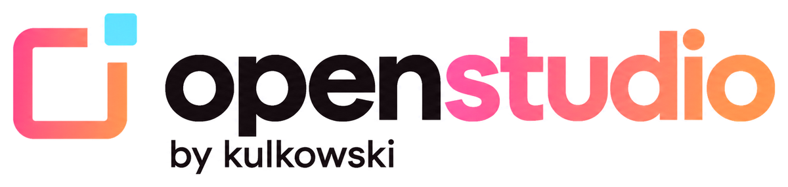
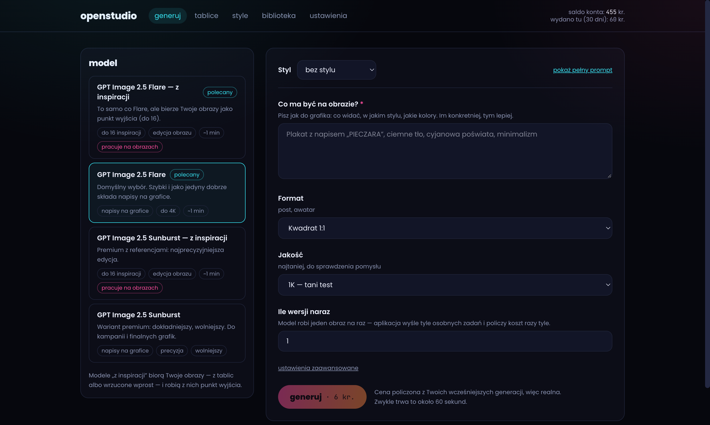

<p align="center">
  <picture>
    <source media="(prefers-color-scheme: dark)" srcset="docs/logo.png">
    
  </picture>
</p>

**Twoje własne studio AI do obrazów. Wklejasz swój klucz API, płacisz tylko za to, co naprawdę wygenerujesz, a wszystkie pliki zostają na Twoim dysku.**

Bez abonamentu, bez przepalonych kredytów na koniec miesiąca, bez konta w kolejnym serwisie. Generatory obrazów udostępniają swoje API — OpenStudio to po prostu wygodny interfejs do niego, który uruchamiasz u siebie.



## Trzy sposoby na uruchomienie

### 1. Mam Claude Code / Codex / Cursor

Sklonuj to repo, otwórz je w swoim agencie i napisz: **„uruchom”**.
W repo jest plik [`CLAUDE.md`](CLAUDE.md) (i bliźniaczy `AGENTS.md`), który mówi agentowi, co ma zrobić krok po kroku — łącznie z diagnostyką, gdy coś nie zadziała.

### 2. Mam 3 minuty

1. Zainstaluj [Node.js 22 LTS](https://nodejs.org) (jeden instalator, „Dalej → Dalej”).
2. W terminalu wpisz:
   ```bash
   npx openstudio@latest
   ```
3. Przeglądarka otworzy się sama. Wklej klucz API i generuj.

Później wystarczy wejść na `http://127.0.0.1:4321` — adres możesz zapisać w zakładkach. Token dopisuje się sam, o ile wchodzisz z paska adresu tej samej przeglądarki.

Paczka ma interfejs zbudowany z góry i **zero zależności wymagających kompilacji** — to najczęstszy powód, dla którego takie aplikacje „nie chcą się zainstalować” na Windowsie.

### 3. Chcę ikonkę na pulpicie

To wersja 2. Na razie działa `npx`.

## Skąd wziąć klucz

Zobacz [docs/JAK-ZDOBYC-KLUCZ.md](docs/JAK-ZDOBYC-KLUCZ.md). W skrócie: konto na [kie.ai](https://kie.ai/api-key?ref=openstudio) ([link bez polecenia](https://kie.ai/api-key)), doładowanie dowolnie małą kwotą, skopiowanie klucza ze strony „API Key”.

> Link z `?ref=` to link polecający — jeśli z niego skorzystasz, wspierasz rozwój projektu. Obok zawsze jest link zwykły. Nic nie jest ukryte w kodzie.

## Co potrafi (v1)

- **Generowanie obrazów** modelami GPT Image 2.5 (Flare i Sunburst), 1K / 2K / 4K, 13 formatów.
- **Cena przed kliknięciem** — na przycisku widzisz, ile kredytów zapłacisz. Po każdej generacji aplikacja kalibruje cennik prawdziwym kosztem zwróconym przez API.
- **Limit wydatków na 30 dni** — blokada *zanim* cokolwiek pójdzie do dostawcy.
- **Kolejka**, która przeżywa zamknięcie aplikacji: niedokończone zadania wracają do sprawdzania po restarcie.
- **Automatyczne pobieranie na dysk** — linki u dostawcy żyją około 24 godzin, więc plik ląduje u Ciebie natychmiast, razem z opisem, jakim promptem powstał.
- **Diagnostyka** jednym kliknięciem: raport gotowy do wklejenia w zgłoszeniu, **bez klucza API**.

- **Tablice** — moodboard jak Pinterest. Wrzucasz inspiracje (przeciągnięciem, `Cmd/Ctrl+V`, przeciągnięciem obrazka z innej karty albo linkiem), zaznaczasz 3–4 i klikasz **„generuj w tym klimacie”**. Gotowe obrazy wracają na tablicę przyciskiem „📌 Przypnij”, więc najlepsze wyniki stają się referencjami dla kolejnych.
  Inspiracje leżą na Twoim dysku. Do dostawcy trafiają **tylko te, których użyjesz w generacji**, i dopiero w momencie kliknięcia — raz na plik, z ważnością 20 godzin.

- **Własne obrazy z rolami** — do generacji dorzucasz swoje zdjęcie, logo albo produkt (przeciągnięciem, `Cmd/Ctrl+V` albo przyciskiem) i każdemu nadajesz rolę: *inspiracja*, *osoba*, *produkt*, *logo*, *tło*, *obraz do edycji* albo *własna instrukcja*. Aplikacja dopisuje do promptu numerowaną listę „co zrobić z którym obrazem” — w tej samej kolejności, w jakiej obrazy idą do modelu. Widać to w „pokaż pełny prompt”.
- **Style** — zapisany przepis na wygląd, włączany jednym kliknięciem przy każdej generacji. Paletę wyciągamy z Twoich inspiracji **lokalnie w przeglądarce** (bez API i bez kosztów), opis składasz z gotowych określeń po polsku zamiast pisać prompt, a „czego unikać” działa raz a dobrze. Przycisk **„pokaż pełny prompt”** zawsze pokazuje dokładnie to, co pojedzie do modelu.
  Styl **wyeksportujesz do pliku `.styl.json`** i wyślesz komuś; gotowe style leżą w [`styles/`](styles/).

  > Uczciwie: modele traktują kody kolorów orientacyjnie. Paleta przesuwa całość w Twoją stronę, ale nie zagwarantuje odcienia co do numeru.

- **Infografika z tekstu** — wklejasz artykuł, notatki albo ofertę (lub wrzucasz plik `.docx`, `.md`, `.html`, `.txt` — Word i Google Docs „pobierz jako Word” działają), a aplikacja układa **plan planszy**: tytuł, 3–7 punktów, wyróżnione liczby. Plan poprawiasz w edytorze, wybierasz układ (lista, kroki, porównanie, liczby, mapa myśli) i jednym kliknięciem prompt ląduje w generatorze — ze stylem, logo i podglądem pełnego promptu jak przy każdej innej generacji.
  „Ułóż plan” jest darmowy i lokalny (nagłówki, wypunktowania, liczby z tekstu). „Ułóż plan modelem” woła model czatu Kie **na tym samym kluczu** — zwykle ułamek kredytu — i radzi sobie lepiej z długim, nieuporządkowanym tekstem. Plik nie opuszcza komputera; do dostawcy idzie tylko tekst, i tylko gdy sam klikniesz.

W przygotowaniu: wideo („Animuj" z biblioteki) i kolejni dostawcy modeli.

## Bezpieczeństwo

Aplikacja wydaje prawdziwe pieniądze, więc traktujemy ją poważnie:

- nasłuchuje **wyłącznie na `127.0.0.1`** — nikt z Twojej sieci Wi-Fi się nie dobije,
- API jest zamknięte bez **tokenu sesji** (ochrona przed złośliwą stroną otwartą w tej samej przeglądarce). Token leży w `config.json` obok klucza, więc restart aplikacji nie zabija otwartej karty; gdy link gdzieś wycieknie, unieważnisz go komendą `npx openstudio reset-token`,
- token trafia do strony **tylko** przy wejściu z paska adresu lub z zakładki (`Sec-Fetch-Site: none`, nagłówek ustawiany przez przeglądarkę, którego obca witryna nie podrobi). Żądanie z cudzej strony, z ramki, z `fetch`-a i z `curl`-a tokenu nie dostaje — pilnują tego testy. Osadzanie w ramce jest zablokowane (`X-Frame-Options: DENY`),
- sprawdzamy nagłówki `Host` i `Origin` (ochrona przed DNS rebinding),
- klucz leży w `~/OpenStudio/config.json` z prawami `0600` i **nigdy** nie trafia do przeglądarki, logów ani raportu diagnostycznego — pilnuje tego automatyczny test,
- `createTask` (POST) nie jest **nigdy** ponawiany automatycznie, bo dostawca nie ma klucza idempotencji, a podwójne wysłanie to podwójna opłata.

Zalecenie: załóż u dostawcy **osobny klucz** tylko dla tej aplikacji, żeby móc go skasować bez konsekwencji.

## Gdzie są moje pliki

```
~/OpenStudio/
├─ config.json          ← klucz i ustawienia (prawa 0600)
├─ jobs.json            ← historia zadań
├─ ledger.json          ← ile kredytów poszło na co
├─ boards.json          ← tablice inspiracji
├─ uploads.json         ← które inspiracje są aktualnie wysłane do dostawcy
├─ styles.json          ← Twoje style
├─ boards/<id>/         ← pliki inspiracji
└─ library/2026-09/     ← obrazy + JSON z promptem obok każdego
```

## Dodanie nowego modelu (bez pisania kodu)

Jeden model = jeden plik JSON w [`models/`](models/). Formularz w aplikacji buduje się z tego pliku sam. Opis pól: [`models/README.md`](models/README.md). Pull requesty mile widziane — CI sprawdza poprawność manifestu.

## Komendy

```bash
npx openstudio            # uruchamia aplikację
npx openstudio doctor        # raport diagnostyczny (bez klucza API)
npx openstudio reset-token   # nowy token sesji (stare linki przestają działać)
npx openstudio --help
```

## Dla programistów

```bash
npm install && npm --prefix web install
npm run build     # buduje interfejs do web/dist
npm test          # 63 testy: adapter API, kolejka, tablice, bezpieczeństwo, redakcja klucza
npm start
```

## Licencja i zastrzeżenia

MIT. Projekt **niezależny**, niepowiązany z Kie.ai ani z żadnym dostawcą modeli. Płacisz bezpośrednio dostawcy, na jego warunkach; moderacja treści jest po jego stronie. Inspiracje na tablicach to Twoja odpowiedzialność — inspiruj się stylem, nie kopiuj cudzych prac.

---

## English summary

**OpenStudio is a local, open-source image studio that runs on your own API key.** No subscription, no wasted credits, no account on yet another service: you paste a [Kie.ai](https://kie.ai/api-key) key, generate with GPT Image 2.5, and every file stays on your disk (`~/OpenStudio/`).

- **Price before you click** — calibrated from the real `creditsConsumed` returned by the API; optional 30-day spending cap enforced *before* anything is sent.
- **Boards** — a Pinterest-like moodboard. Drop files, paste from clipboard, drag from another tab or paste a URL; select 3–4 pins and hit *generate in this vibe*. Pins are uploaded lazily, only when used, once per file.
- **Your own images with roles** — add your photo, logo or product and tell the model what to do with each one (*person*, *logo*, *product*, *background*, *edit this*, custom). The prompt gets a numbered list in the same order the model receives the images. *Show full prompt* always displays exactly what is sent.
- **Styles** — a saved "look recipe": palette extracted in the browser (no API), chip-based description, things to avoid, strength. Export as `.styl.json`.
- **Safe by design** — binds to `127.0.0.1` only, session token, Host/Origin checks, key stored with `0600`, never logged; `createTask` is never retried automatically (no idempotency key upstream → double charge).
- **Beginner-friendly** — `npx openstudio`, zero native dependencies, and a `CLAUDE.md`/`AGENTS.md` so an AI agent can install and troubleshoot it for you: clone, open in Claude Code, type *run*.

The UI is in Polish for now; the code, manifests and docs structure are ready for localisation. Unofficial project, not affiliated with Kie.ai.
